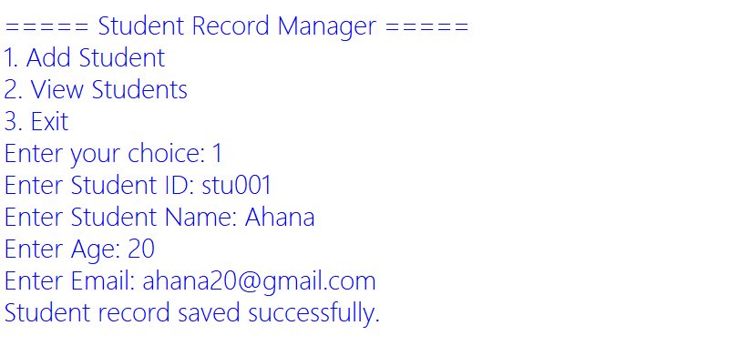
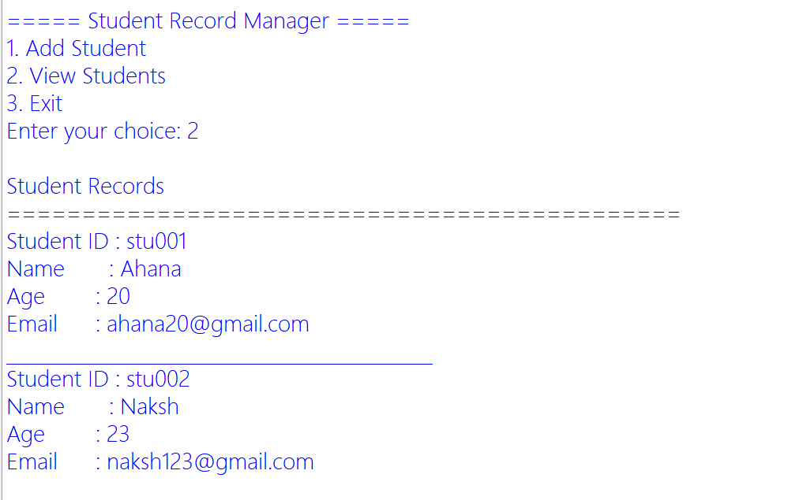

# 📚 Student Record Manager

A simple and efficient **Student Record Manager** developed using **Python** that allows users to store and manage student information through a menu-driven interface. The application demonstrates the use of **file handling**, **exception handling**, **regular expressions**, and **functions** while maintaining student records in a text file.

---

# 📖 Project Overview

The **Student Record Manager** is a console-based application that enables users to add and view student records. Each student record consists of a **Student ID**, **Name**, **Age**, and **Email Address**. The application validates email addresses before saving the data and stores all records in a text file for future retrieval.

This project is designed to strengthen the understanding of Python fundamentals and file management techniques.

---

# ✨ Features

* 🆔 Add Student ID
* 👤 Add Student Name
* 🎂 Store Student Age
* 📧 Email Validation using Regular Expressions
* 💾 Save Student Records in a Text File
* 📋 View All Student Records
* ⚠️ Exception Handling for Invalid Inputs
* 🖥️ Menu-Driven Console Interface

---

# 🛠️ Technologies Used

* Python 3
* File Handling
* Regular Expressions (`re` Module)
* Exception Handling

---

# 📂 Project Structure

```text
Student_Record_Manager/
│
├── screenshots/
│   ├── add_student.png
│   └── view_students.png
│
├── student_manager.py
├── students.txt
├── README.md
└── .gitignore
```

---

# 📌 Functionalities

## ➕ Add Student

The application allows users to enter:

* Student ID
* Student Name
* Age
* Email Address

The email address is validated before the record is stored.

### Example Input

```text
Enter Student ID: 101
Enter Student Name: Lahari
Enter Age: 20
Enter Email: lahari@gmail.com
```

---

## 📋 View Student Records

Displays all stored student records in a clean and readable format.

### Example Output

```text
Student Records
=============================================
Student ID : stu001
Name       : Swara
Age        : 20
Email      : swara21@gmail.com
_____________________________________________

Student ID : stu102
Name       : Rahul
Age        : 21
Email      : rahul@gmail.com
_____________________________________________
```

---

# 📸 Application Screenshots

| ➕ Add Student                               | 📋 View Student Records                         |
| ------------------------------------------- | ----------------------------------------------- |
|  |  |

---

# 📂 Data Storage

Student information is stored in the file:

```text
students.txt
```

Each record is stored in the following format:

```text
StudentID,Name,Age,Email
```

Example:

```text
stu001,Swara,20,swara21@gmail.com
stu002,Rahul,21,rahul@gmail.com
```

---

# 📧 Email Validation

The application validates email addresses using Python's **Regular Expressions (Regex)**.

Example of a valid email:

```text
student@example.com
```

If an invalid email is entered, the program displays an error message and prevents the record from being saved.

---

# 🎯 Learning Outcomes

This project demonstrates the implementation of:

* Python Functions
* File Handling
* Reading and Writing Files
* Exception Handling
* Regular Expressions
* Input Validation
* Menu-Driven Programming
* Data Storage and Retrieval

---


# 👩‍💻 Author

**Lakshmi Lahari**


---

## ⭐ Thank You

Thank you for visiting this repository.

